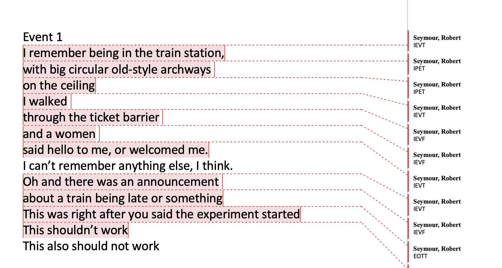
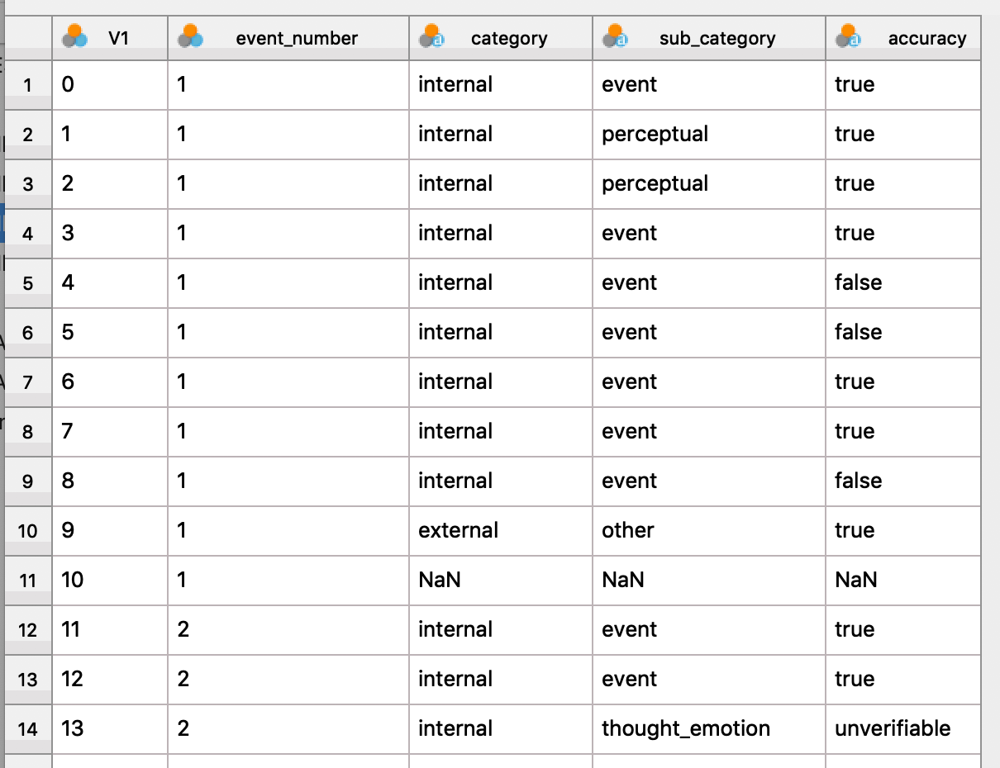
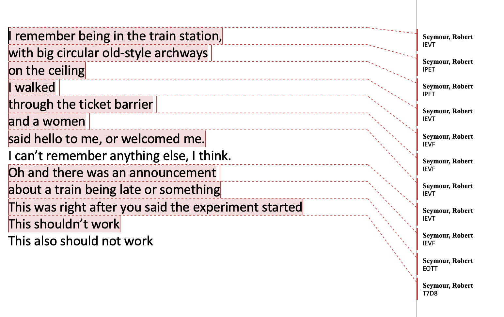
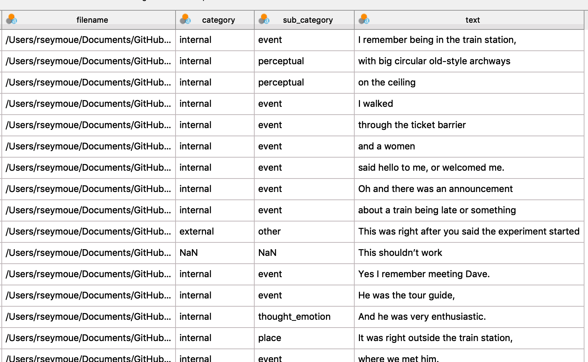

# autoAIscore

Code to automatically extract data from Autobiographical Interview (AI) transcripts, scored by hand in Microsoft Word.

## Installing Python

*Instructions to follow*

Required Packages: docx, lxml, zipfile, pandas, re

## Filbury Study

#### Marking .docx files

- One document should hold transcriptions each participant and for all events
- Events should be clearly separated by 'Event XX' before each transcription of the event
- For each event, split details into new paragraphs (new line) according to AI scoring protocols
- For each detail you wish to score, highlight the relevent text and add a new comment
> Speed this up by creating a keyboard shortcut for 'New Comment'

- The comment should contain a 4 letter code, corresponding to the (adapted) Autobiographical Interview scoring protocol:

>- Letter 1: I (Internal Detail) or E (External Detail)
>- Letter 2-3: EV (Event), PE (Perceptual), TI (Time), PL (Place), TH (Thought/Emotion), SE (Semantic), RE (Repetition), OT (Other)
>- Letter 4: T (True), F (False), U (Unverifiable)

It should look like this:



#### Running the code

In the command line run (for example):

```python
python3 process_AIscores_filbury.py test_filbury/test_participant01.docx
```

The script should print any warnings/errors encountered, and export a .csv file with the same name as the .docx file, organised like so:




## Conventional AI

#### Marking .docx files

- Each folder should contain separate transcription documents for each memory, from one participant and **NO OTHER .docx FILES**
- Split details into new paragraphs (new line) according to AI scoring protocol
- For each detail you wish to score, highlight the relevent text and add a new comment
> Speed this up by creating a keyboard shortcut for 'New Comment'

- The comment should contain a 3 letter code, corresponding to the Autobiographical Interview scoring protocol:

>- Letter 1: I (Internal Detail) or E (External Detail)
>- Letter 2-3: EV (Event), PE (Perceptual), TI (Time), PL (Place), TH (Thought/Emotion), SE (Semantic), RE (Repetition), OT (Other)

It should look like this:



#### Running the code

In the command line run (for example):

```python
python3 process_AIscores.py test_AI/ testAI/out.csv
```

The script should print any warnings/errors encountered, and export a .csv file organised like so:




